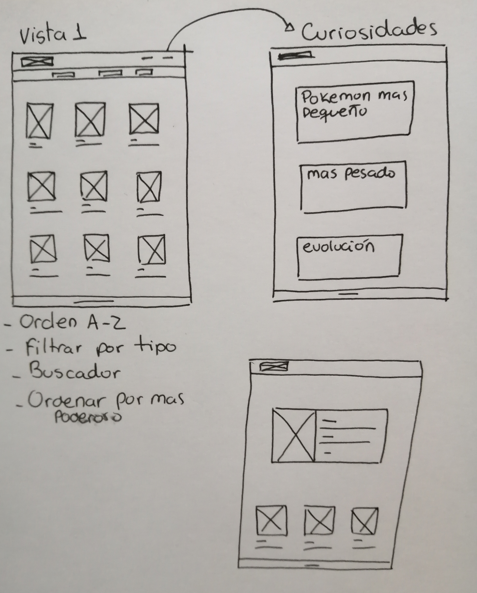
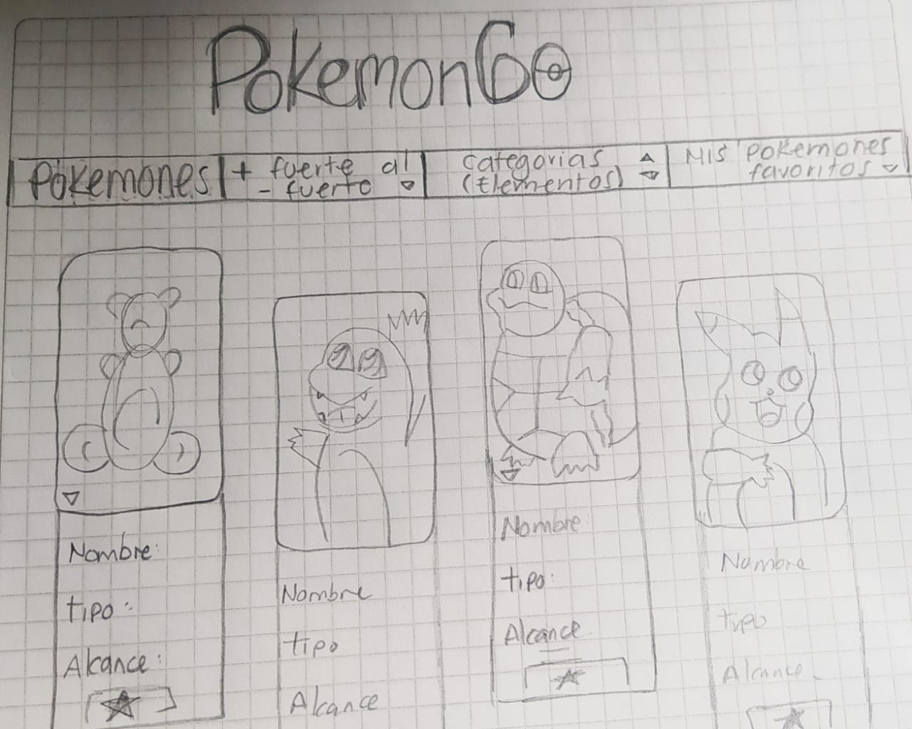
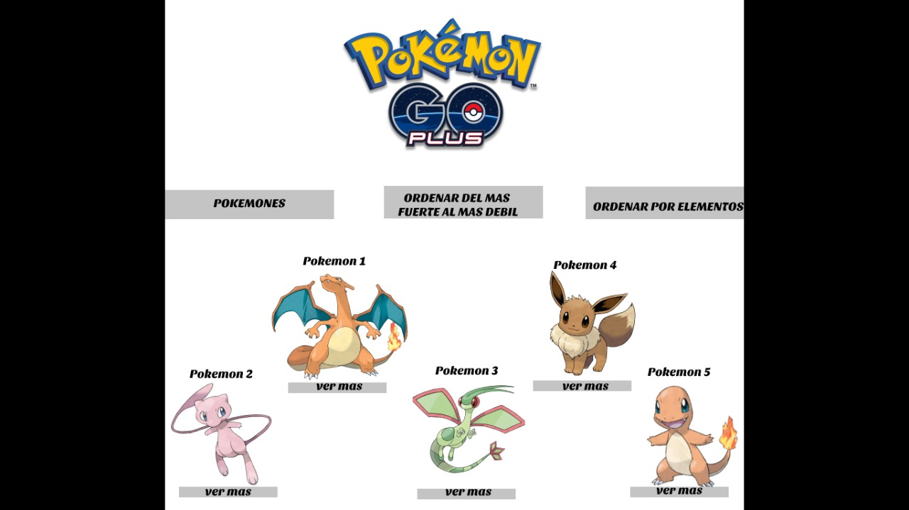
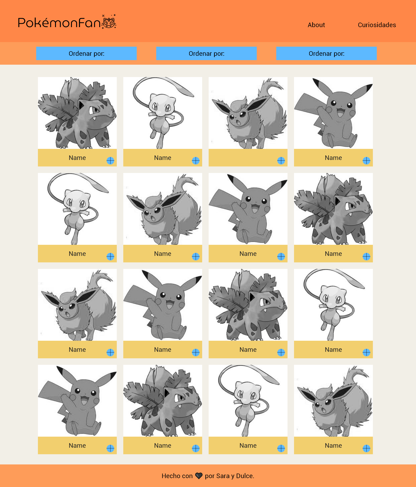

<figure>

</figure>

* [1. Definición del producto](#1-definición-del-producto)
* [2. Historia de usuarios](#2-historias-de-usuarios)
* [3. Prototipos de baja fidelidad](#3-prototipos-de-baja-fidelidad)
* [4. Prototipos de alta fidelidad](#4-prototipos-de-alta-fidelidad)
* [5. Test de usabilidad](#5-test-de-usabilidad)
* [6. Objetivos de aprendizaje](#6-objetivos-de-aprendizaje)

***

## 1. Definición del producto

Aplicación creada para usuarios nuevos y fans de Pokémon y pokémonGO, aquí podrán encontrar su pokémon favorito, conocer otros nuevos, cuantos caramelos necesitan para evolucionar y mucho mas. Buscamos y encontramos los objetivos mas comunes en los usuarios al ingresar a este tipo de APPs, y luego resolvimos los problemas a través de una interfaz fácil de usar y legible.

## 2. Historia de usuarios

1. Como jugador de PokemonGo, quiero ver todos los Pokémon en la pantalla, para identificar los que no conozca.
2. Como fan de PokémonGO, quiero poder filtrar el avatar según su tipo, para saber cuantos hay por categoría.
3. Como jugador, quiero ordenar los avatares por orden alfabético, para tener mas orden.
4. Como conocedor del juego y de los personajes, quiero buscar un Pokémon en especifico, para leer solo las características de este y encontrarlo rápidamente.
5. Como usuario nuevo del juego me gustaría saber curiosidades y estadísticas para adentrarme mas en el tema.
6. Como principiante en el mundo pokémon, quiero conocer su historia y el uso de pokémonGo, para resolver dudas.

## 3. Prototipos de baja fidelidad

<figure>

<figcaption>Primeros prototipos</figcaption>
</figure>

<figure>

<figcaption>Primeros prototipos</figcaption>
</figure>

<figure>

<figcaption>Primeros prototipos</figcaption>
</figure>

## 4. Prototipos de alta fidelidad

<figure>

<figcaption>Prototipo de alta fidelidad</figcaption>
</figure>

<figure>

<figcaption>Prototipo de alta fidelidad para celular</figcaption>
</figure>

## 5.Test de usabilidad

Mediante nuestros test con usuarios pudimos detectar problemas tanto de diseño como de funcionalidad tales como hovers muy rápidos, bordes difusos, títulos pequeños, contraste en las letras principales, mal uso del tipo de chart entre otros, los cuales logramos solucionar para llegar a un producto mas intuitivo.

<figure>

<figcaption>Página Final</figcaption>
</figure>

## 6. Objetivos de aprendizaje

### HTML y CSS
* [X] Uso de HTML semántico.(https://developer.mozilla.org/en-US/docs/Glossary/Semantics#Semantics_in_HTML)
* [X] Uso de selectores de CSS.
* [X] Construir tu aplicación respetando el diseño realizado (maquetación).
* [X] Uso de flexbox en CSS.(https://css-tricks.com/snippets/css/a-guide-to-flexbox/)

### DOM y Web APIs

* [X] Uso de selectores del DOM.
* [X] Manejo de eventos del DOM.
* [X] Manipulación dinámica del DOM.https://developer.mozilla.org/es/docs/Referencia_DOM_de_Gecko/Introducci%C3%B3n)
(appendChild |createElement | createTextNode| innerHTML | textContent | etc.)

### JavaScript
* [X] Uso de condicionales (if-else | switch | operador ternario)
* [X] Uso de bucles (for | for..in | for..of | while)
* [X] Uso de funciones (parámetros | argumentos | valor de retorno)
* [X] Manipular arrays (filter | map | sort | reduce)
* [X] Manipular objects (key | value)
* [X] Uso ES modules ([`import`](https://developer.mozilla.org/en-US/docs/Web/JavaScript/Reference/Statements/import)
| [`export`](https://developer.mozilla.org/en-US/docs/Web/JavaScript/Reference/Statements/export))
* [] Diferenciar entre expression y statements.
* [] Diferenciar entre tipos de datos atómicos y estructurados.

### Testing

* [X] [Testeo unitario.](https://jestjs.io/docs/es-ES/getting-started)

### Estructura del código y guía de estilo

* [X] Organizar y dividir el código en módulos (Modularización)
* [X] Uso de identificadores descriptivos (Nomenclatura | Semántica)
* [X] Uso de linter (ESLINT)

### Git y GitHub

* [X] Uso de comandos de git (add | commit | pull | status | push)
* [X] Manejo de repositorios de GitHub (clone | fork | gh-pages)
* [X] Colaboración en Github (branches | pull requests | |tags)

### UX

* [X] Diseñar la aplicación pensando y entendiendo al usuario.
* [X] Crear prototipos para obtener feedback e iterar.
* [X] Aplicar los principios de diseño visual (contraste, alineación, jerarquía)
* [X] Planear y ejecutar tests de usabilidad.

